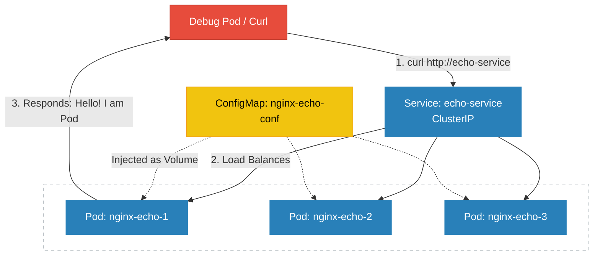

# Kubernetes ClusterIP Service

Services in K8s is not pods or containers. They are actually configured in the Linux Kernel network stack using IP Tables and DNS Service.

To see this in action lets deploy a nginx server  which returns the ip address of in the response when a request is sent to it.

## To do this we need to create

- ConfigMap which will update the **default.conf** file to return the server IP Address. We will map the configMap as a volume in the container.

```yaml
apiVersion: v1
kind: ConfigMap
metadata:
  name: nginx-echo-config
data:
  default.conf: |
    server {
      listen 80;
      server_name localhost;
      location / {
        default_type text/plain;
        return 200 "Hello! I am Pod: \$server_addr\n";
      }
    }
```
- Create a deployment of nginx server with the volume mounted using the mount path of /etc/nginx/config.d, We will add a tags **spec.template.metadata.labels** to identify the pods and the **spec.selector.matchLabels** for the deployment controller to search the pods with that label.

```yaml
apiVersion: apps/v1
kind: Deployment
metadata:
  name: nginx-echo
spec:
  replicas: 3
  selector:
    matchLabels:
      app: echo-app
  template:
    metadata:
      labels:
        app: echo-app
    spec:
      containers:
        - name: nginx
          image: nginx:alpine
          ports:
            - containerPort: 80
          volumeMounts:
            - name: config-volume
              mountPath: /etc/nginx/conf.d
      volumes:
        - name: config-volume
          configMap:
            name: nginx-echo-config
```


- We create a **CLUSTERIP** service which resides inside the cluster and can be accessed **only inside the cluster**. It cannot be accessed from outside the cluster.  Selector is very important as thats what identify which pods the traffic will be redirected to.

```yaml
apiVersion: v1
kind: Service
metadata:
  name: echo-service
spec:
  type: ClusterIP  
  selector:
    app: echo-app  
  ports:
    - protocol: TCP
      port: 80        
      targetPort: 80 
```

- Architecture Diagram




To get the service and its ip address, we can run the following command. We can check the ip addresses of our pods.


```bash
yash@YashDevBox ~> kubectl get service echo-service
yash@YashDevBox ~> kubectl get pods -o custom-columns=NAME:metadata.name,IP:status.pod
yash@YashDevBox ~> kubectl describe pod nginx-echo-7d68cf9b87-rn8pw
```

To view underneath how the traffic is routed, we can ssh into the cluster and  run the following command and examine its output.

```bash
docker@minikube:~$ sudo iptables -t nat -S | grep echo-service
```

<pre>docker@minikube:~$ sudo iptables -t nat -S | grep echo-service
-A KUBE-SEP-3S34T3QK6SRXEDAX -s 10.244.2.68/32 -m comment --comment &quot;default/<font color="#C01C28"><b>echo-service</b></font>&quot; -j KUBE-MARK-MASQ
-A KUBE-SEP-3S34T3QK6SRXEDAX -p tcp -m comment --comment &quot;default/<font color="#C01C28"><b>echo-service</b></font>&quot; -m tcp -j DNAT --to-destination 10.244.2.68:80
-A KUBE-SEP-5Y4MGY52GMWTUEHA -s 10.244.2.89/32 -m comment --comment &quot;default/<font color="#C01C28"><b>echo-service</b></font>&quot; -j KUBE-MARK-MASQ
-A KUBE-SEP-5Y4MGY52GMWTUEHA -p tcp -m comment --comment &quot;default/<font color="#C01C28"><b>echo-service</b></font>&quot; -m tcp -j DNAT --to-destination 10.244.2.89:80
-A KUBE-SEP-KKEO7B76UIBGA72V -s 10.244.2.69/32 -m comment --comment &quot;default/<font color="#C01C28"><b>echo-service</b></font>&quot; -j KUBE-MARK-MASQ
-A KUBE-SEP-KKEO7B76UIBGA72V -p tcp -m comment --comment &quot;default/<font color="#C01C28"><b>echo-service</b></font>&quot; -m tcp -j DNAT --to-destination 10.244.2.69:80
-A KUBE-SERVICES -d 10.102.37.243/32 -p tcp -m comment --comment &quot;default/<font color="#C01C28"><b>echo-service</b></font> cluster IP&quot; -j KUBE-SVC-OWN6ZV2ZABLQT7IJ
-A KUBE-SVC-OWN6ZV2ZABLQT7IJ ! -s 10.244.0.0/16 -d 10.102.37.243/32 -p tcp -m comment --comment &quot;default/<font color="#C01C28"><b>echo-service</b></font> cluster IP&quot; -j KUBE-MARK-MASQ
-A KUBE-SVC-OWN6ZV2ZABLQT7IJ -m comment --comment &quot;default/<font color="#C01C28"><b>echo-service</b></font> -&gt; 10.244.2.68:80&quot; -m statistic --mode random --probability 0.33333333349 -j KUBE-SEP-3S34T3QK6SRXEDAX
-A KUBE-SVC-OWN6ZV2ZABLQT7IJ -m comment --comment &quot;default/<font color="#C01C28"><b>echo-service</b></font> -&gt; 10.244.2.69:80&quot; -m statistic --mode random --probability 0.50000000000 -j KUBE-SEP-KKEO7B76UIBGA72V
-A KUBE-SVC-OWN6ZV2ZABLQT7IJ -m comment --comment &quot;default/<font color="#C01C28"><b>echo-service</b></font> -&gt; 10.244.2.89:80&quot; -j KUBE-SEP-5Y4MGY52GMWTUEHA
</pre>

This is very interesting output and shows how the traffic jumps from the Service to the pods based on the probability.

**Entry Point**: A rule that says "If traffic is going to SERVICE-IP, jump to chain KUBE-SVC-MASQ"

**Load Balancer**: Inside that chain, you'll see rules using the -m statistic --mode random --probability 0.50 module. This is how Kubernetes decides which Pod gets the traffic if you have multiple replicas.

**Destination (DNAT)**: Finally, a rule will point to a specific Pod IP. This is where the packet's destination header is actually rewritten.
