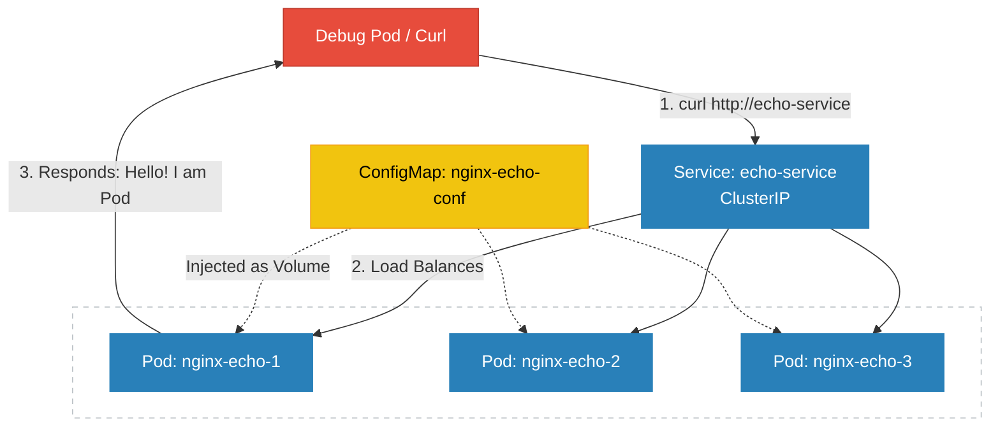

Services in K8s is not pods or containers. They are actually configured in the Linux Kernel network stack using IP Tables and DNS Service.

To see this in action lets deploy a nginx server  which returns the ip address of in the response when a request is sent to it.

## To do this we need to create

1. ConfigMap which will update the **default.conf** file to return the server IP Address. We will map the configMap as a volume in the container.

```yaml
apiVersion: v1
kind: ConfigMap
metadata:
  name: nginx-echo-config
data:
  default.conf: |
    server {
      listen 80;
      server_name localhost;
      location / {
        default_type text/plain;
        return 200 "Hello! I am Pod: \$server_addr\n";
      }
    }
```
2. Create a deployment of nginx server with the volume mounted using the mount path of /etc/nginx/config.d, We will add a tags **spec.template.metadata.labels** to identify the pods and the **spec.selector.matchLabels** for the deployment controller to search the pods with that label.

```yaml
apiVersion: apps/v1
kind: Deployment
metadata:
  name: nginx-echo
spec:
  replicas: 3
  selector:
    matchLabels:
      app: echo-app
  template:
    metadata:
      labels:
        app: echo-app
    spec:
      containers:
        - name: nginx
          image: nginx:alpine
          ports:
            - containerPort: 80
          volumeMounts:
            - name: config-volume
              mountPath: /etc/nginx/conf.d
      volumes:
        - name: config-volume
          configMap:
            name: nginx-echo-config
```


3. We create a **CLUSTERIP** service which resides inside the cluster and can be accessed **only inside the cluster**. It cannot be accessed from outside the cluster.


