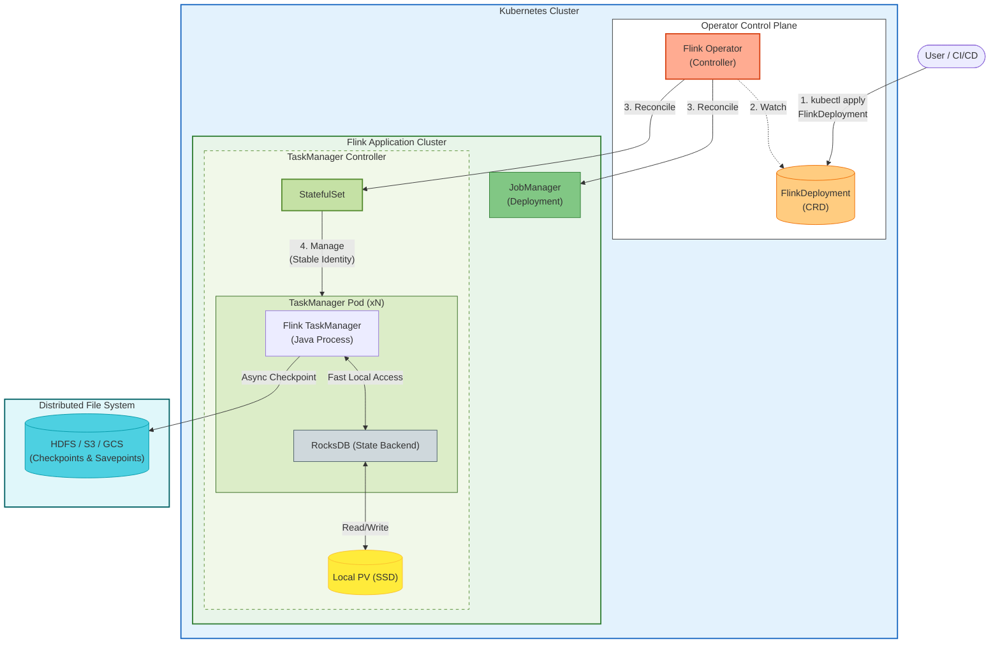

```mermaid
graph TD
    subgraph K8s["Kubernetes Cluster"]
        style K8s fill:#e3f2fd,stroke:#1565c0,stroke-width:2px
        
        subgraph ControlPlane["Operator Control Plane"]
            style ControlPlane fill:#fff,stroke:#333
            CRD[("FlinkDeployment\n(CRD)")]
            style CRD fill:#ffcc80,stroke:#ef6c00
            
            Operator["Flink Operator\n(Controller)"]
            style Operator fill:#ffab91,stroke:#d84315,stroke-width:2px
        end

        subgraph FlinkCluster["Flink Application Cluster"]
            style FlinkCluster fill:#e8f5e9,stroke:#2e7d32,stroke-width:2px
            
            JM["JobManager\n(Deployment)"]
            style JM fill:#81c784,stroke:#2e7d32
            
            subgraph TM_Controller ["TaskManager Controller"]
                style TM_Controller fill:#f1f8e9,stroke:#558b2f,stroke-dasharray: 5 5
                
                STS["StatefulSet"]
                style STS fill:#c5e1a5,stroke:#558b2f,stroke-width:2px
                
                subgraph TM_Pod ["TaskManager Pod (xN)"]
                    style TM_Pod fill:#dcedc8,stroke:#33691e
                    
                    TM_Process["Flink TaskManager\n(Java Process)"]
                    RocksDB["RocksDB (State Backend)"]
                    style RocksDB fill:#cfd8dc,stroke:#455a64
                end
            
                PVC[("Local PV (SSD)")]
                style PVC fill:#ffeb3b,stroke:#fbc02d
            end
        end
    end

    subgraph DFS ["Distributed File System"]
        style DFS fill:#e0f7fa,stroke:#006064,stroke-width:2px
        HDFS[("HDFS / S3 / GCS\n(Checkpoints & Savepoints)")]
        style HDFS fill:#4dd0e1,stroke:#0097a7
    end

    User([User / CI/CD]) -->|"1. kubectl apply\nFlinkDeployment"| CRD
    
    Operator -.->|"2. Watch"| CRD
    Operator -->|"3. Reconcile"| JM
    Operator -->|"3. Reconcile"| STS
    
    STS -->|"4. Manage\n(Stable Identity)"| TM_Pod
    
    TM_Process <-->|"Fast Local Access"| RocksDB
    RocksDB <-->|"Read/Write"| PVC
    
    TM_Process -->|"Async Checkpoint"| HDFS
    
    classDef k8s fill:#326ce5,stroke:#fff,stroke-width:2px,color:#fff;
```