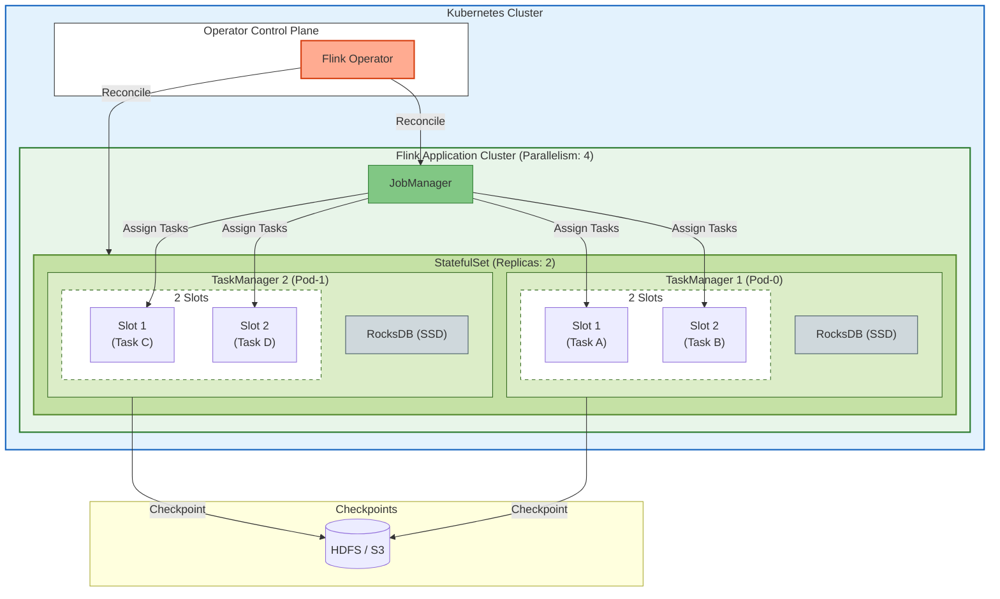

# Flink Kubernetes Operator

```mermaid
graph TD
    subgraph K8s["Kubernetes Cluster"]
        style K8s fill:#e3f2fd,stroke:#1565c0,stroke-width:2px
        
        subgraph ControlPlane["Operator Control Plane"]
            style ControlPlane fill:#fff,stroke:#333
            Operator["Flink Operator"]
            style Operator fill:#ffab91,stroke:#d84315,stroke-width:2px
        end

        subgraph FlinkCluster["Flink Application Cluster (Parallelism: 4)"]
            style FlinkCluster fill:#e8f5e9,stroke:#2e7d32,stroke-width:2px
            
            JM["JobManager"]
            style JM fill:#81c784,stroke:#2e7d32
            
            subgraph STS ["StatefulSet (Replicas: 2)"]
                style STS fill:#c5e1a5,stroke:#558b2f,stroke-width:2px
                
                subgraph TM1 ["TaskManager 1 (Pod-0)"]
                    style TM1 fill:#dcedc8,stroke:#33691e
                    
                    subgraph Slots1 ["2 Slots"]
                        style Slots1 fill:#fff,stroke:#33691e,stroke-dasharray: 5 5
                        Slot1_1["Slot 1\n(Task A)"]
                        Slot1_2["Slot 2\n(Task B)"]
                    end
                    
                    RocksDB1["RocksDB (SSD)"]
                    style RocksDB1 fill:#cfd8dc,stroke:#455a64
                end

                subgraph TM2 ["TaskManager 2 (Pod-1)"]
                    style TM2 fill:#dcedc8,stroke:#33691e
                    
                    subgraph Slots2 ["2 Slots"]
                        style Slots2 fill:#fff,stroke:#33691e,stroke-dasharray: 5 5
                        Slot2_1["Slot 1\n(Task C)"]
                        Slot2_2["Slot 2\n(Task D)"]
                    end
                    
                    RocksDB2["RocksDB (SSD)"]
                    style RocksDB2 fill:#cfd8dc,stroke:#455a64
                end
            end
        end
    end

    subgraph DFS ["Checkpoints"]
        HDFS[("HDFS / S3")]
    end

    Operator --"Reconcile"--> JM
    Operator --"Reconcile"--> STS
    
    JM --"Assign Tasks"--> Slot1_1
    JM --"Assign Tasks"--> Slot1_2
    JM --"Assign Tasks"--> Slot2_1
    JM --"Assign Tasks"--> Slot2_2

    TM1 --"Checkpoint"--> HDFS
    TM2 --"Checkpoint"--> HDFS

    classDef k8s fill:#326ce5,stroke:#fff,stroke-width:2px,color:#fff;
```