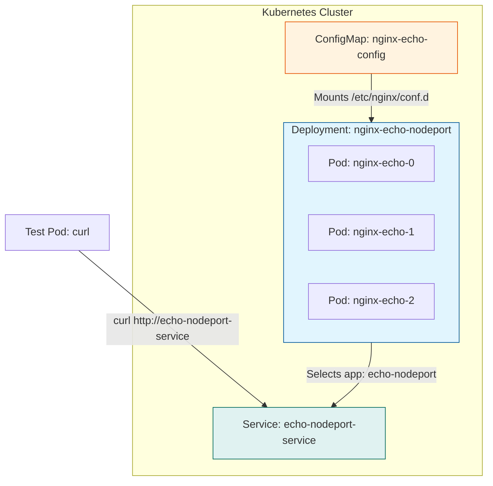
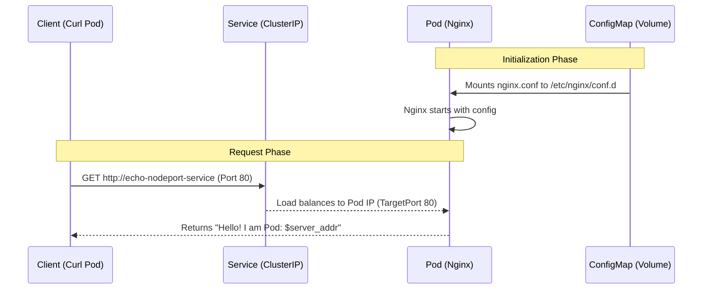

# Kubernetes NodePort Service

With NodePort service k8s opens a port on each node and when we access the service from outside using the ip address:port the traffic gets routed to out service.

This is generally used for local testing. It is not very secure because it open a number of port on each node on the cluster.  Difference between NODEPORT and CLUSTERIP  service type is ClusterIP can be only accessed from inside the cluster whereas the NodePORT can be accessed from outside the cluster using the NODEADDRESS:PORT.


The analogy thats given is CLUSTERIP is like Intercom in a office and NODEPORT Is like a phone provided outside the Bldg which can be used to called the internal phones.


The best way to think of different types of services provided by the Kubernetes is

   **ExternalService --> WRAPS  -->  LOAD BALANCER --> WRAPS --> NODEPORT --> WRAPS -->  CLUSTERIP**


The above this is a very important thing to remember. 


To create and test this is similar to the previous post but with some important differences.

```yaml

# ConfigMap.yaml
apiVersion: v1
kind: ConfigMap
metadata:
  name: nginx-echo-config
data:
  default.conf: |
    server {
      listen 80;
      server_name localhost;
      location / {
        default_type text/plain;
        return 200 "Hello! I am Pod: \$server_addr\n";
      }
    }

# Application.yaml
apiVersion: apps/v1
kind: Deployment
metadata:
  name: nginx-echo-nodeport
spec:
  replicas: 3
  selector:
    matchLabels:
      app: echo-nodeport
  template:
    metadata:
      labels:
        app: echo-nodeport
    spec:
      containers:
        - name: nginx
          image: nginx:alpine
          ports:
            - containerPort: 80
          volumeMounts:
            - name: config-volume
              mountPath: /etc/nginx/conf.d
      volumes:
        - name: config-volume
          configMap:
            name: nginx-echo-config

#Service.yaml
apiVersion: v1
kind: Service
metadata:
  name: echo-nodeport-service
spec:
  type: NodePort  
  selector:
    app: echo-nodeport  
  ports:
    - protocol: TCP
      port: 80        
      targetPort: 80  
      nodePort: 30007 

```

# Architecture Diagram





# DataFlow Diagram

